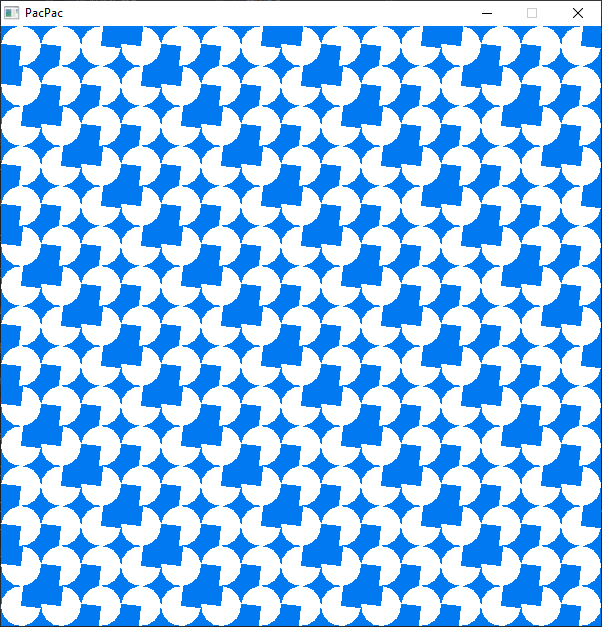

# Raylib Examples

This repository contains a compilation of [raylib library](https://github.com/raysan5/raylib) examples that I start to make tailored for the Windows environment. Run the `compile.bat` file with the example folder as argument to facilitate the compilation of the corresponding example.

## Getting Started

To get started, clone this repository to your local machine using the following command:

```cmd
git clone https://github.com/AdaiasMagdiel/raylib-examples.git
```

### Compilation

To compile the examples, run the `compile.bat` file and pass the example folder as argument. This will ensure that the code is compiled correctly, allowing you to run the example. If you wish to run the program after compilation, just pass the argument 'run' after the example.

For example:

```cmd
compile.bat examples\gradient_rect
```

Or

```cmd
compile.bat examples\pacpac run
```

Maybe you need w64devkit to have GCC and all the necessary tools available, you can download the Devkit MinGW-W64/GCC from [here](https://github.com/skeeto/w64devkit/) and add it to the system's PATH.

## Available Examples

<table>
  <tr>
    <td>
      <a href="./examples/gradient_rect/main.c">
        
      </a>
    </td>
    <td>
      <a href="./examples/pacpac/main.c">
        
      </a>
    </td>
    <td>
      <a href="./examples/truchet_tiles/main.c">
        
      </a>
    </td>
  </tr>

  <tr>
    <td>
      <a href="./examples/snake/main.c">
        
      </a>
    </td>
  </tr>
</table>

## Used Libraries

### raylib

This project utilizes the raylib library for generate graphics. Please review the raylib license before using or contributing to this project. Refer to the [LICENSE-raylib](raylib/LICENSE-raylib) file for more details.

## License

This project is licensed under the MIT License - see the [LICENSE](LICENSE) file for details.
